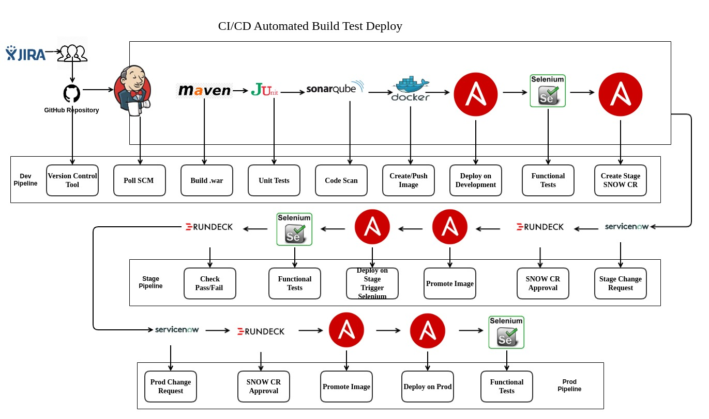

# Single Touch Deployment

This is a concept to implement the end-to-end deployment with no manual intervention. This is a continues process with 100% automation, this ensures application sanity, correctness, vulnerability scans, containerization, deployments. 

This ALM (Application Lifecycle Management) will increase the efficiency of application deliverables.

## Overview
In single-touch-deployment process, the deployment is automatically triggered. The development environment release is triggered within the CICD pipeline, which is initiated by code push or tag creation master branch. In the case of stage and production deployment, the deployment trigger is based on the approval mechanism, typically it is ServiceNOW.

The fixed and repetitive process of application build, scan and deploy. Environments specific manifest used in the deployment cycle. The manifest details can be changed easily & quickly as per the release. Dedicated process for each step, which makes it maintainable and scalable. 

The process comprises the collection of specialized application release automation platforms. This automatic deployment system simplified the application deployment tasks and mitigate risk making complex and manual operations, reliable, repeatable, and error-free. This helps to accelerate the time-to-release and effectively reduces the toil.

## Tools stack

### Jenkins
This tool is a very integral part of single-touch-deployment. In this tool the shared-library is used, you can find all the functions definitions in the Jenkins-shared-library directory. 

### maven
This is a java application tool to build the app. It prepares the required artifactory for deployment. Maven is also triggering the sonar scan.

### JUnit
This is the unit testing tool that runs the test cases to generate the code coverage and code sanity report on the sonarqube portal

### SonarQube
This tool is used to run the code sanity checks, which generate the consolidated reports on the portal. It also has quality gates that ensure that code passes all checks.

### Docker
Docker is used for containerization, this will ensure that the application dependencies and other libraries are packaged inside an image which will eventually be deployed as a container in the Openshift cluster.

### Ansible
Playbooks are the tasks that are there to do the deployment, SNOW ticket creation, start the Rundeck jobs. These playbooks are the key turning point in all of the automation, it also has the python script combination which makes it more robust.

### Selenium
This tool is used in the crucial stage of the ALM cycle to decide to move ahead in the deployment.

### ServiceNOW
ServiceNow has always been the workflow management tool to get the required approval from the application stakeholders.

                                

## How it works

"Picture speaks a thousand words !!!"

