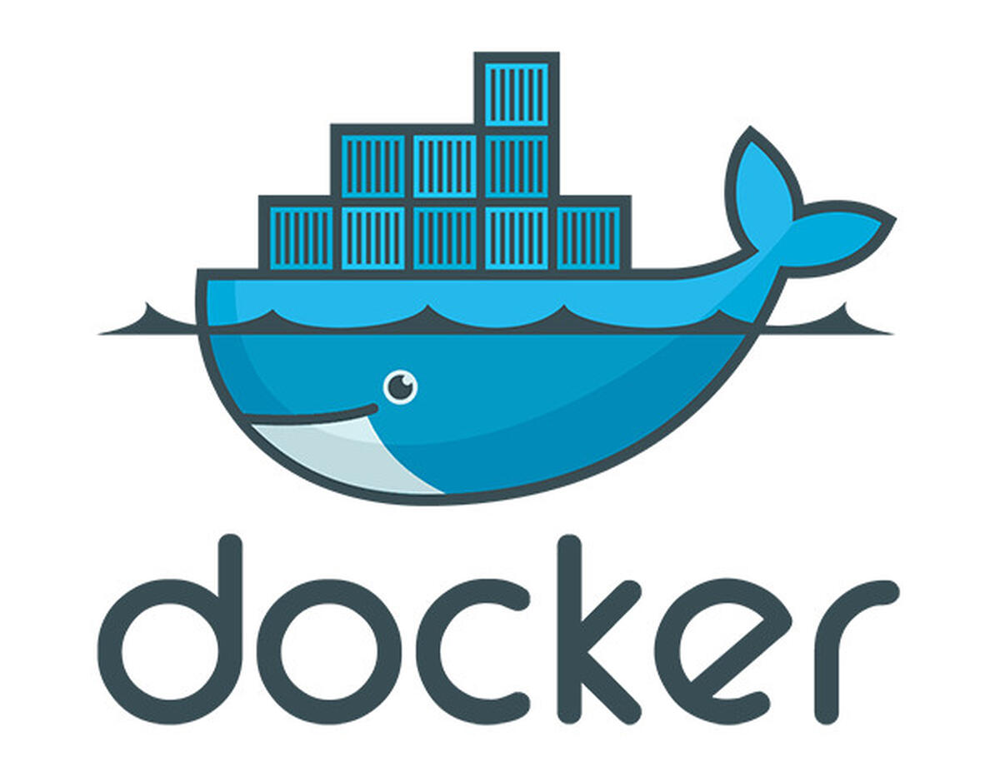

# Single Touch Deployment

This is an concept to implementing the end-to-end deployment with no manual intervention. This is the continues process with 100% automation, this ensures application sanity, correctness, vulnerability scans, containerization, deployments. 

This ALM (Application Lifecycle Management) will increase the efficiency of application deliverables.

## Overview
In single-touch-deployment process, the deployment is automatically triggered. The development environment release is triggered within the CICD pipeline, which is initiated by code push or tag creation master branch. In case of stage and production deployment, the deployment trigger is based on the approval machnism, typically it is ServiceNOW.

Fixed and repeatetive process of application build, scan, and deploy. Environments specific manifest used in the deployment cycle. The manifest details can be changed easily & quickly as per release. Dedicated process for each steps, which makes it maintainalble and scaleble. 

The process comprise with collection of specialized application release automation platform. This automatic deployment system simplified the application deployment tasks and mitigate risk making complex and manual operations, reliable, repeatable and error-free. This helps to accelerate the time-to-release and effectivly reduces the toil.

## Tools stack

### Jenkins
### MAVEN
### JUnit
### SonarQube
### Docker
### Ansible
### Selenium
### ServiceNOW

                                
## How it works
